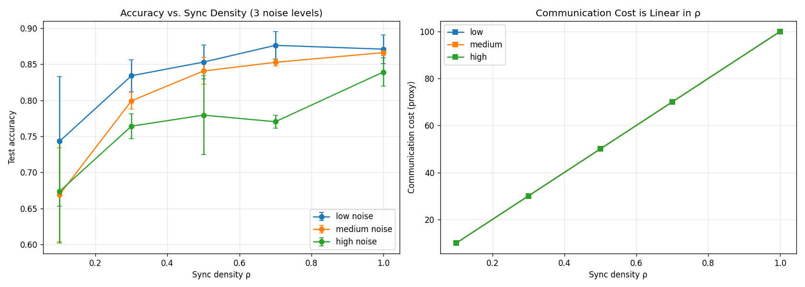

# Connection-Density Trade-offs in Multi-Agent Systems

[]()
[]()
[]()
[](demo.ipynb)

> **How much should agents in a multi-agent system communicate?**
> I pre-registered four predictions, ran a real experiment, and reported
> the result honestly — including the one that failed.

---

## The result, up front



*Left: test accuracy vs. sync density ρ for three noise levels (3 seeds, error bars = std).
Right: communication cost is exactly linear while accuracy gain is sub-linear.*

---

## The story

### 1 — The hypothesis

Multi-agent systems face a fundamental tension: more communication
reduces noise through consensus, but erodes independent diversity.
The trade-off model predicts an **interior optimum** ρ\*:

```
J(ρ) = V(ρ)          +  η · ρᵖ
        ↑                  ↑
  consensus benefit    diversity cost
```

A prior simulation across 36 parameter regimes showed ρ\* ranges 0.10–1.00
and ρ\* = 0.5 occurs in only ~6% of cases — **not a universal law.**
See [`src/honest_sensitivity.py`](src/honest_sensitivity.py).

### 2 — The pre-registration

Four predictions were **locked before any real data was seen**:
([`prereg/PRE_REGISTRATION.md`](prereg/PRE_REGISTRATION.md))

| ID | Prediction |
|----|-----------|
| **P1** | Interior optimum ρ\* ∈ (0,1) exists at **every** noise level |
| **P2** | ρ\* shifts with client noise (more noise → higher ρ\*) |
| **P3** | ρ\* ≠ 0.5 universally |
| **P4** | Comm cost linear in ρ; accuracy gain sub-linear |

### 3 — The experiment

MNIST federated learning · 10 clients · 3 noise levels · 5 sync densities · 3 seeds
Code: [`src/fed_experiment.py`](src/fed_experiment.py)

### 4 — The results

| ID | Prediction | Verdict | What happened |
|----|-----------|---------|---------------|
| **P1** | Interior optimum at every noise level | ❌ **FAIL** | Low noise: ρ\*=0.7 ✓ · Medium & high: peaked at boundary ρ=1.0 |
| **P2** | ρ\* shifts with noise | ✅ **PASS** | Peaks moved 0.7 → 1.0 → 1.0 |
| **P3** | ρ\* ≠ 0.5 universally | ✅ **PASS** | No noise level peaked at 0.5 |
| **P4** | Comm linear, accuracy sub-linear | ✅ **PASS** | 10× bandwidth → only 1.17× accuracy |

Raw numbers (mean over 3 seeds):

| Noise | ρ=0.1 | ρ=0.3 | ρ=0.5 | ρ=0.7 | ρ=1.0 | **Peak** |
|-------|-------|-------|-------|-------|-------|----------|
| low (5%)    | 0.743 | 0.834 | 0.853 | **0.876** | 0.871 | **ρ=0.7** ← interior ✅ |
| medium (20%)| 0.669 | 0.799 | 0.841 | 0.853 | **0.866** | **ρ=1.0** ← boundary ❌ |
| high (40%)  | 0.674 | 0.764 | 0.779 | 0.770 | **0.839** | **ρ=1.0** ← boundary ❌ |

### 5 — The honest failure

P1 claimed an interior optimum at **every** noise level. It appeared
only at low noise. Why? In this setup all 10 clients draw from the same
distribution, so the diversity penalty γ is weak — the β/γ ratio is
large, and the sensitivity analysis already predicted ρ\* → 1.0 in that
case. **The framework's internal prediction was right; the external
pre-registered claim was too strong.**

**What I won't do:** retroactively redefine P1 to pass. The verdict in
[`results/verdicts.json`](results/verdicts.json) says `FAIL` and
[`paper/HONEST_PAPER.md`](paper/HONEST_PAPER.md) §6 is an explicit
retraction.

### 6 — The insight

> *"When β/γ is large, full synchronization wins. An interior optimum
> only exists in the moderate-β/γ regime. Measure it first — don't
> assume ρ\*."*

Practical takeaway (P4): **10× the bandwidth buys only 17% more
accuracy.** That ratio matters for real federated system design.

> A 4/4 pass would have been suspicious. 0/4 would be a refutation.
> **3/4 with one honest retraction is what calibrated science looks like.**

---

## Interactive demo

Explore the results without re-running the experiment:

```bash
pip install -r requirements.txt
jupyter notebook demo.ipynb
```

[`demo.ipynb`](demo.ipynb) loads [`results/raw_results.json`](results/raw_results.json),
re-plots every curve, and prints the verdict logic step-by-step —
runs in under 5 seconds, no GPU needed.

---

## Reproduce from scratch

```bash
git clone <this-repo>
cd connection-density-tradeoff

python3.11 -m venv .venv
source .venv/bin/activate
pip install -r requirements.txt

cd src
python fed_experiment.py        # ~5–10 min on CPU
python honest_sensitivity.py    # sensitivity sweep, ~1 min
```

See [`docs/REPRODUCING.md`](docs/REPRODUCING.md) for determinism notes.

---

## Repository layout

```
connection-density-tradeoff/
├── README.md                      ← you are here
├── demo.ipynb                     ← interactive results explorer ⭐
├── requirements.txt
├── CHANGELOG.md
│
├── prereg/
│   ├── PRE_REGISTRATION.md        ← v2.1 predictions (frozen — do not edit)
│   └── PRE_REGISTRATION_v3.md     ← v3.0 non-IID predictions (locked) ⬅ new
│
├── src/
│   ├── fed_experiment.py          ← IID experiment (v2.1)
│   ├── fed_experiment_noniid.py   ← non-IID regime test (v3.0) ⬅ new
│   └── honest_sensitivity.py      ← simulation that falsified v1
│
├── results/
│   ├── fed_results.png            ← plot embedded above
│   ├── raw_results.json           ← all (noise × ρ × seed) numbers
│   └── verdicts.json              ← P1–P4 machine-readable verdicts
│
├── paper/
│   ├── HONEST_PAPER.md            ← full paper v2.1 (with retraction §6)
│   ├── RESULTS_REPORT.md          ← detailed empirical writeup
│   └── TRUTH_FALSITY_MATRIX.md    ← what survived contact with data
│
└── docs/
    └── REPRODUCING.md
```

---

## Claims and non-claims

| ✅ This repo claims | ❌ This repo does not claim |
|--------------------|-----------------------------|
| Interior optima *can* exist when β/γ is moderate | Interior optimum exists at every noise level |
| ρ\* is system-specific, not universal | A universal "50% rule" of any kind |
| 10× comm buys only 1.17× accuracy in this regime | Cross-domain unification |
| Pre-registration prevents post-hoc spin | — |

---

## Methodology commitments

1. **Predictions locked first** — [`prereg/PRE_REGISTRATION.md`](prereg/PRE_REGISTRATION.md) timestamped before the run.
2. **No post-hoc tuning** — parameters fixed before the run; no sweep done after seeing results.
3. **Failure reported as failure** — `verdicts.json` → `"P1": "FAIL (at least one boundary peak)"`. Goalposts not moved.
4. **All artifacts public** — raw JSON, verdicts, plot, code, paper, pre-registration.

---

## What's next

1. **Non-IID regime test** (v3.0) — pre-registration locked in
   [`prereg/PRE_REGISTRATION_v3.md`](prereg/PRE_REGISTRATION_v3.md).
   Each client sees only 2 digit classes, making the diversity penalty γ much
   larger. Theory predicts the interior optimum should reappear. Run it:
   ```bash
   cd src && python fed_experiment_noniid.py
   ```
2. **Adversarial clients** — a known fraction reports wrong labels on purpose.
   Will be pre-registered before any data is touched.

---

## Citation

See [`CITATION.cff`](CITATION.cff). Please cite both the paper and the
retraction — they are inseparable.

---

## License

MIT — see [`LICENSE`](LICENSE).
