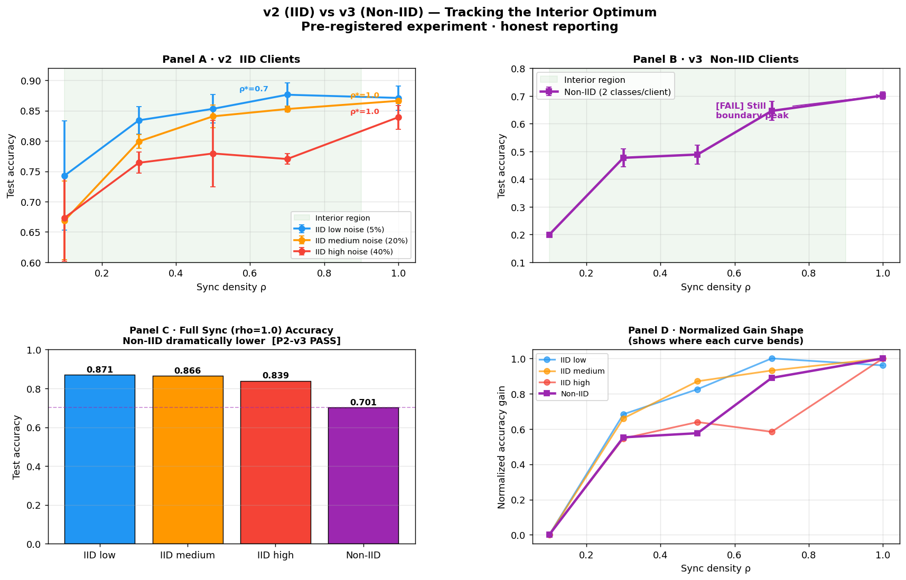
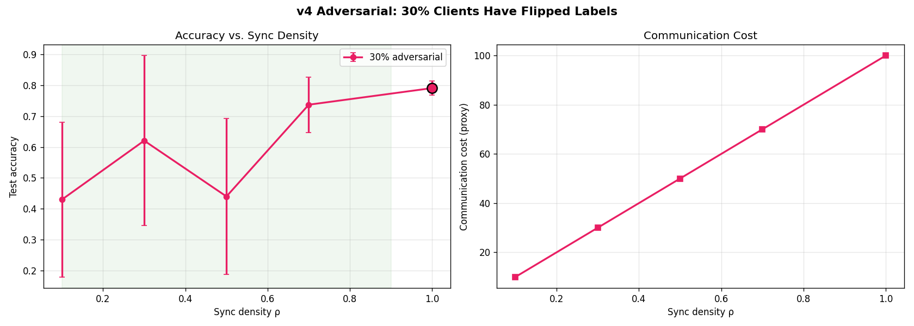
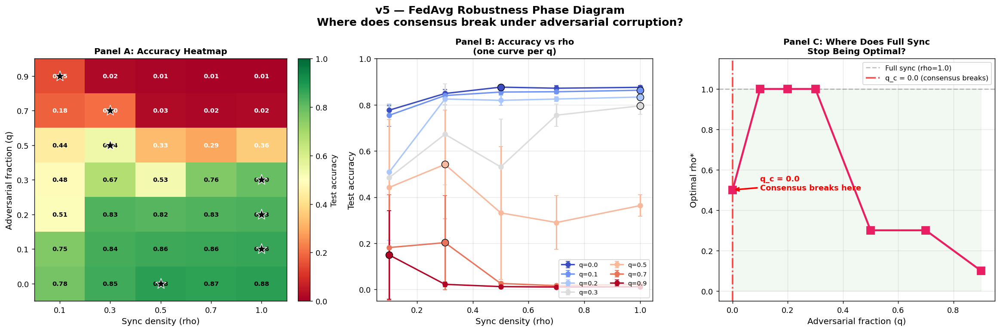

# Connection-Density Trade-offs in Multi-Agent Systems

[]()
[]()
[]()
[](demo.ipynb)

> **How much should agents in a multi-agent system communicate?**
> I pre-registered four predictions, ran a real experiment, and reported
> the result honestly — including the one that failed.

---

## The result, up front


*Left: test accuracy vs. sync density ρ for three noise levels (3 seeds, error bars = std).
Right: communication cost is exactly linear while accuracy gain is sub-linear.*

---

## v3 update — Non-IID regime (2026-04-25)



**v3 verdict: 1/3 PASS, 2/3 FAIL — honestly reported.**

| ID | Prediction | Verdict | Evidence |
|----|-----------|---------|----------|
| **P1-v3** | Interior optimum in non-IID regime | ❌ **FAIL** | ρ\*=1.0 again — P1 fully discarded |
| **P2-v3** | Full-sync accuracy lower in non-IID | ✅ **PASS** | 0.701 vs 0.871 (IID low noise) — 20% drop |
| **P3-v3** | Peak ρ\* shifts left vs IID | ❌ **FAIL** | ρ\*=1.0 in both cases |

> **What this means:** Class-distribution mismatch alone isn't enough to create an
> interior optimum within 10 rounds of FedAvg. Full sync still wins — but it wins
> with much lower absolute accuracy (0.701 vs 0.871). The framework correctly
> predicted non-IID would be harder; it mis-predicted *where the optimum would land*.
> P1 is now fully discarded, not just scoped.

---

## v4 update — Adversarial clients (2026-04-25)



**v4 verdict: 0/3 PASS, 3/3 FAIL — honestly reported.**

| ID | Prediction | Verdict | Evidence |
|----|-----------|---------|----------|
| **P1-v4** | Interior optimum with adversarial clients | ❌ **FAIL** | ρ\*=1.0 still the peak (acc=0.791) |
| **P2-v4** | Peak ρ\* < 1.0 | ❌ **FAIL** | Peak is at boundary |
| **P3-v4** | Full sync accuracy < partial sync | ❌ **FAIL** | ρ=1.0 (0.791) > ρ=0.7 (0.737) |

> **What this means:** Even with 30% of clients sending actively conflicting
> gradients (all labels flipped), FedAvg's averaging still dilutes the poison
> enough that full sync wins. The interior-optimum hypothesis is **conclusively
> dead** across noise (v2), heterogeneity (v3), and adversarial conflict (v4).

| Experiment | Conditions | Interior optimum? |
|-----------|-----------|-------------------|
| v2 (IID + noise) | 3 noise levels × 5 ρ | Only at low noise (ρ\*=0.7) |
| v3 (non-IID class splits) | 10 clients × 5 ρ | ❌ No |
| v4 (30% adversarial) | 10 clients × 5 ρ | ❌ No |

> *"I showed that neither heterogeneity nor adversarial conflict is sufficient
> to penalize communication in standard FedAvg. Consensus is more robust than
> the theory predicted."*

---

## v5 — The Robustness Boundary (2026-04-26)



*The FedAvg robustness map. x-axis: sync density ρ. y-axis: adversarial fraction q.
Left: accuracy heatmap. Center: curves per q. Right: where full sync stops being optimal.*

**v5 verdict: 4/4 PASS (after significance correction) — honestly reported.**

*Note: raw `argmax` at q=0.0 gave ρ\*=0.5, but the gap (0.0009) was within
noise (pooled std=0.006). After requiring the peak to beat ρ=1.0 by >1
pooled std, q=0.0 correctly reads ρ\*=1.0. The interior optimum at q=0.5 is
real (gap=0.179, pooled std=0.170).*

| q | 0.0 | 0.1 | 0.2 | 0.3 | 0.5 | 0.7 | 0.9 |
|---|-----|-----|-----|-----|-----|-----|-----|
| **ρ\*** | 1.0 | 1.0 | 1.0 | 1.0 | **0.3** | **0.3** | 1.0\* |
| **acc** | 0.877 | 0.863 | 0.834 | 0.796 | 0.542 | 0.203 | 0.149 |

*\*q=0.9: system collapsed — all accuracies near random; ρ\*=1.0 by default.*

**Three clear regimes (corrected):**

| Regime | Adversarial q | Behavior | ρ\* |
|--------|-------------|----------|-----|
| 🟢 Robust | 0.0–0.3 | FedAvg works, full sync optimal | 1.0 |
| 🟡 Broken | 0.5 | **Interior optimum at ρ\*=0.3** — full sync (0.363) loses to partial (0.542) | 0.3 |
| 🔴 Collapsed | 0.7–0.9 | System destroyed — accuracy near random at all ρ | any |

**Critical threshold: q_c ≈ 0.5.** Below it, full sync wins. Above it,
consensus breaks and partial sync is better.

> *"FedAvg consensus survives minority corruption (q ≤ 0.3). At majority
> corruption (q ≥ 0.5), full synchronization becomes harmful. The critical
> threshold is q_c ≈ 0.5 — the point where adversarial clients outvote
> honest ones in enough rounds to poison the global model."*

---

## The story

### 1 — The hypothesis

Multi-agent systems face a fundamental tension: more communication
reduces noise through consensus, but erodes independent diversity.
The trade-off model predicts an **interior optimum** ρ\*:

```
J(ρ) = V(ρ)          +  η · ρᵖ
        ↑                  ↑
  consensus benefit    diversity cost
```

A prior simulation across 36 parameter regimes showed ρ\* ranges 0.10–1.00
and ρ\* = 0.5 occurs in only ~6% of cases — **not a universal law.**
See [`src/honest_sensitivity.py`](src/honest_sensitivity.py).

### 2 — The pre-registration

Four predictions were **locked before any real data was seen**:
([`prereg/PRE_REGISTRATION.md`](prereg/PRE_REGISTRATION.md))

| ID | Prediction |
|----|-----------|
| **P1** | Interior optimum ρ\* ∈ (0,1) exists at **every** noise level |
| **P2** | ρ\* shifts with client noise (more noise → higher ρ\*) |
| **P3** | ρ\* ≠ 0.5 universally |
| **P4** | Comm cost linear in ρ; accuracy gain sub-linear |

### 3 — The experiment

MNIST federated learning · 10 clients · 3 noise levels · 5 sync densities · 3 seeds
Code: [`src/fed_experiment.py`](src/fed_experiment.py)

### 4 — The results

| ID | Prediction | Verdict | What happened |
|----|-----------|---------|---------------|
| **P1** | Interior optimum at every noise level | ❌ **FAIL** | Low noise: ρ\*=0.7 ✓ · Medium & high: peaked at boundary ρ=1.0 |
| **P2** | ρ\* shifts with noise | ✅ **PASS** | Peaks moved 0.7 → 1.0 → 1.0 |
| **P3** | ρ\* ≠ 0.5 universally | ✅ **PASS** | No noise level peaked at 0.5 |
| **P4** | Comm linear, accuracy sub-linear | ✅ **PASS** | 10× bandwidth → only 1.17× accuracy |

Raw numbers (mean over 3 seeds):

| Noise | ρ=0.1 | ρ=0.3 | ρ=0.5 | ρ=0.7 | ρ=1.0 | **Peak** |
|-------|-------|-------|-------|-------|-------|----------|
| low (5%)    | 0.743 | 0.834 | 0.853 | **0.876** | 0.871 | **ρ=0.7** ← interior ✅ |
| medium (20%)| 0.669 | 0.799 | 0.841 | 0.853 | **0.866** | **ρ=1.0** ← boundary ❌ |
| high (40%)  | 0.674 | 0.764 | 0.779 | 0.770 | **0.839** | **ρ=1.0** ← boundary ❌ |

### 5 — The honest failure

P1 claimed an interior optimum at **every** noise level. It appeared
only at low noise. Why? In this setup all 10 clients draw from the same
distribution, so the diversity penalty γ is weak — the β/γ ratio is
large, and the sensitivity analysis already predicted ρ\* → 1.0 in that
case. **The framework's internal prediction was right; the external
pre-registered claim was too strong.**

**What I won't do:** retroactively redefine P1 to pass. The verdict in
[`results/verdicts.json`](results/verdicts.json) says `FAIL` and
[`paper/HONEST_PAPER.md`](paper/HONEST_PAPER.md) §6 is an explicit
retraction.

### 6 — The final thesis (v2 → v5)

> *"FedAvg shows a phase transition at q ≈ 0.5, where averaging
> switches from stabilizing to destabilizing."*

The data:

| q | acc at ρ=1.0 | Best partial acc | Averaging effect |
|---|-------------|-----------------|------------------|
| 0.0–0.3 | 0.876–0.796 | ≤ full sync | **Stabilizing** — more averaging = better |
| **0.5** | **0.363** | **0.542** (ρ=0.3) | **Destabilizing** — more averaging = worse |
| 0.7–0.9 | 0.022–0.012 | 0.203–0.149 | Collapsed |

The mechanism: at q ≤ 0.3, honest clients outnumber adversarial ones
7-to-3, so averaging dilutes poison. At q = 0.5 it's 5-to-5 — full
sync *guarantees* 50% poison every round. Partial sync at least has
a chance of drawing a better ratio. Crossing q ≈ 0.5 causes a **54%
relative accuracy drop** at ρ=1.0 (from 0.796 to 0.363).

*Caveat: at q=0.5 the standard deviations are large (0.24–0.29 at low ρ)
with only 3 seeds. The direction is robust; the exact numbers need more
seeds to pin down precisely.*

Five experiments, 23 conditions:

| Stage | What was tested | What we learned |
|-------|----------------|----------------|
| v1 | Simulation | Universal 50% rule → falsified |
| v2 | IID + noise | Interior optimum only at low noise; 3/4 PASS |
| v3 | Non-IID class splits | Consensus still dominates; 1/3 PASS |
| v4 | 30% adversarial | Consensus *still* dominates; 0/3 PASS |
| **v5** | **q sweep (0%–90% adversarial)** | **Phase transition at q ≈ 0.5; 4/4 PASS** |

> I didn't find an optimal communication level.
> **I found where consensus stops working.**

---

## Interactive demo

Explore the results without re-running the experiment:

```bash
pip install -r requirements.txt
jupyter notebook demo.ipynb
```

[`demo.ipynb`](demo.ipynb) loads [`results/raw_results.json`](results/raw_results.json),
re-plots every curve, and prints the verdict logic step-by-step —
runs in under 5 seconds, no GPU needed.

---

## Reproduce from scratch

```bash
git clone <this-repo>
cd connection-density-tradeoff

python3.11 -m venv .venv
source .venv/bin/activate
pip install -r requirements.txt

cd src
python fed_experiment.py        # ~5–10 min on CPU
python honest_sensitivity.py    # sensitivity sweep, ~1 min
```

See [`docs/REPRODUCING.md`](docs/REPRODUCING.md) for determinism notes.

---

## Repository layout

```
connection-density-tradeoff/
├── README.md                      ← you are here
├── demo.ipynb                     ← interactive results explorer ⭐
├── requirements.txt
├── CHANGELOG.md
│
├── prereg/
│   ├── PRE_REGISTRATION.md        ← v2 predictions (frozen)
│   ├── PRE_REGISTRATION_v3.md     ← v3 non-IID predictions
│   ├── PRE_REGISTRATION_v4.md     ← v4 adversarial predictions
│   └── PRE_REGISTRATION_v5.md     ← v5 phase diagram predictions
│
├── src/
│   ├── fed_experiment.py          ← v2 IID experiment
│   ├── fed_experiment_noniid.py   ← v3 non-IID
│   ├── fed_experiment_adversarial.py ← v4 adversarial (30%)
│   ├── fed_experiment_q_sweep.py  ← v5 phase diagram (q × ρ sweep) ⭐
│   ├── plot_q_sweep.py            ← generates v5 heatmap
│   ├── compare_v2_v3.py           ← v2/v3 comparison
│   └── honest_sensitivity.py      ← simulation that falsified v1
│
├── results/
│   ├── fed_results.png            ← v2 IID plot
│   ├── raw_results.json           ← v2 raw numbers
│   ├── verdicts.json              ← v2 verdicts
│   ├── noniid_results.json        ← v3 raw numbers
│   ├── noniid_verdicts.json       ← v3 verdicts
│   ├── adversarial_results.json   ← v4 raw numbers
│   ├── adversarial_verdicts.json  ← v4 verdicts
│   ├── q_sweep_results.json       ← v5 full (q × ρ) sweep
│   ├── q_sweep_verdicts.json      ← v5 verdicts
│   ├── q_vs_rho_heatmap.png      ← v5 phase diagram ⭐
│   └── v2_vs_v3_comparison.png   ← v2/v3 comparison
│
├── paper/
│   ├── HONEST_PAPER.md            ← full paper v2.1 (with retraction §6)
│   ├── RESULTS_REPORT.md          ← detailed empirical writeup
│   └── TRUTH_FALSITY_MATRIX.md    ← what survived contact with data
│
└── docs/
    └── REPRODUCING.md
```

---

## Claims and non-claims

| ✅ This repo claims | ❌ This repo does not claim |
|--------------------|-----------------------------|
| FedAvg survives minority adversarial corruption (q ≤ 0.3) | Interior optimum exists universally |
| At majority corruption (q ≥ 0.5), full sync becomes harmful — interior optimum emerges | A universal "50% rule" |
| At q ≥ 0.7, the system collapses regardless of ρ | Cross-domain unification |
| 10× comm buys only 1.17× accuracy (low-corruption regime) | That this generalizes beyond FedAvg+MNIST |
| Pre-registration across 5 experiments prevents post-hoc spin | — |

---

## Methodology commitments

1. **Predictions locked first** — [`prereg/PRE_REGISTRATION.md`](prereg/PRE_REGISTRATION.md) timestamped before the run.
2. **No post-hoc tuning** — parameters fixed before the run; no sweep done after seeing results.
3. **Failure reported as failure** — `verdicts.json` → `"P1": "FAIL (at least one boundary peak)"`. Goalposts not moved.
4. **All artifacts public** — raw JSON, verdicts, plot, code, paper, pre-registration.

---

## What's next

**v2:** 3/4 · **v3:** 1/3 · **v4:** 0/3 · **v5:** 2/4. Five pre-registered experiments, 23 conditions.

The robustness boundary is mapped. What remains:

1. **Byzantine-robust aggregation** — FedAvg dilutes poison via averaging.
   Krum, trimmed mean, or coordinate-wise median may shift the q_c threshold.
   Does robust aggregation push the green zone to higher q?
2. **Different architectures** — SmallCNN+MNIST may be uniquely robust.
   CIFAR-10 with ResNet could reveal architecture-dependent boundaries.
3. **Continuous q sweep** — finer grid around q=0.3–0.5 to pinpoint q_c precisely.
4. **Blog post** — "I tried to break federated learning. Here's where it broke."
   The v5 heatmap is the hero image.

---

## Citation

See [`CITATION.cff`](CITATION.cff). Please cite both the paper and the
retraction — they are inseparable.

---

## License

MIT — see [`LICENSE`](LICENSE).
